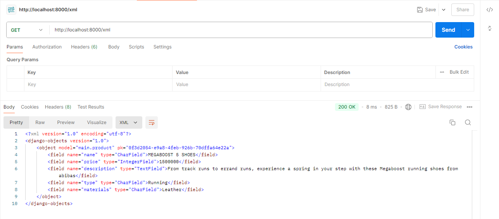

**Tugas Individu 2
-Jelaskan bagaimana cara kamu mengimplementasikan checklist di atas secara step-by-step (bukan hanya sekadar mengikuti tutorial).
1. buat direktori baru untuk projek beserta instalasi-instalasi awal
2. hubungkan dengan repositori remote github
3. buat aplikasi dengan nama main
4. membuat model pada aplikasi main, dengan inisiasi awal 3 atribut wajib
5. melakukan migrasi model agar struktur tabel database ter-update
6. membuat template html
7. menghubungkan view dengan template
8. routing projek (mengatur URL tingkat proyek)
9. membuat routing pada urls.py aplikasi main untuk memetakan fungsi yang telah dibuat pada views.py
10. deploy ke pws(belum karena webnya bermasalah)

-Buatlah bagan yang berisi request client ke web aplikasi berbasis Django beserta responnya dan jelaskan pada bagan tersebut kaitan antara urls.py, views.py, models.py, dan berkas html.

Jadi saat client memulai request ke web menggunakan url(rute url diatur oleh urls.py dan menampilkan view yang bersesuaian), request tersebut akan diteruskan ke framework Django. Pertama-tama, views.py akan mengambil request tersebut, lalu dia akan menjadi perantara antara model dan template html. Model berisi logika yang mengatur hubungan antara aplikasi dengan database. Data-data tersebut dihubungkan ke template html melalui views. Template html mengatur tampilan antarmuka pengguna. Pada akhirnya, django akan memberi respon berupa web page kepada web (internet) yang akan diteruskan ke client (laptop pengguna).

Model: Menyimpan data dan logika aplikasi.
View: Menampilkan data dari model dan menghubungkannya dengan template.
Template(html): Menentukan tampilan antarmuka pengguna.
Urls: Mencocokkan URL permintaan dengan view yang sesuai.

-Jelaskan fungsi git dalam pengembangan perangkat lunak!
git berfungsi sebagai sistem kontrol versi untuk menyimpan, mengelola, dan berbagi source code secara efisien dan kolaboratif. Dengan git, kita bisa melakukan perubahan code dengan aman karena kita bisa membuat beberapa branch untuk projek kita, jika kita melakukan suatu kesalahan maka kesalahan itu hanya berdampak pada 1 branch saja. 

-Menurut Anda, dari semua framework yang ada, mengapa framework Django dijadikan permulaan pembelajaran pengembangan perangkat lunak?
dengan memakai django, kita dapat membuat aplikasi secara cepat tanpa harus melakukan banyak langkah manual. Selain itu, django memiliki dokumentasi yang lengkap. Karena django populer, banyak komunitas yang akan membantu kita dalam menyelesaikan masalah-masalah yang muncul. Selain itu, django adalah framework yang fleksibel.

-Mengapa model pada Django disebut sebagai ORM?
karena dengan menggunakan django, source code kita bisa berinteraksi dengan struktur database, sesuai kepanjangannya (Object-relational mapper)

**Tugas Individu 3
-Jelaskan mengapa kita memerlukan data delivery dalam pengimplementasian sebuah platform?
Dalam pemrograman platform, kita pasti berinteraksi dengan database. Data delivery diperlukan agar proses pengiriman data antara database dengan interface bisa berjalan dengan baik. Proses penghubungan antar data dengan tampilan inilah yang membuat kita memerlukan data delivery.

-Menurutmu, mana yang lebih baik antara XML dan JSON? Mengapa JSON lebih populer dibandingkan XML?
Menurut saya, JSON lebih baik. Alasannya adalah XML lebih kompleks dan membutuhkan struktur tag, sedangkan JSON tidak membutuhkan struktur tag. JSON lebih mudah dibaca dan dan struktur baris kodenya lebih "rapat", hal ini mengurangi ukuran dan bandwidth transfer data, serta meningkatkan kinerja dan efisiensi pemrosesan data

-Jelaskan fungsi dari method is_valid() pada form Django dan mengapa kita membutuhkan method tersebut?
Method is_valid() digunakan untuk melakukan validasi terhadap setiap field dari form. Tentu saja validasi sangat diperlukan ketika kita melakukan hal yang berhubungan dengan input. Misalnya ketika suatu field tidak diisi atau kosong, method tersebut akan memberitahu dengan mengembalikan nilai false, sehingga semua form yang masuk dipastikan formatnya benar.

-Mengapa kita membutuhkan csrf_token saat membuat form di Django? Apa yang dapat terjadi jika kita tidak menambahkan csrf_token pada form Django? Bagaimana hal tersebut dapat dimanfaatkan oleh penyerang?
Kita membutuhkan csrf_token untuk mencegah serangan berbahaya, bisa dibilang csrf_token berfungsi sebagai security. Token tersebut akan di-generate ketika pengguna login di suatu website yang menggunakan csrf_token. Token ini bersifat unik untuk setiap sesi pengguna login. Ketika pengguna mengirim form atau request (POST) ke server, token ini juga akan dikirim, sehingga server bisa memastikan bahwa sebuah request dikirim oleh pengguna website tersebut yang otentik, bukan dari sumber yang tidak dikenal. Dari sini kita tahu bahwa tanpa token ini, sebuah website tidak dapat membedakan mana form atau request yang dikirim oleh pengguna otentik secara sadar dan mana yang bukan. Hal ini bisa dimanfaatkan oleh pihak penyerang, yaitu penyerang bisa menipu sebuah website untuk melakukan sesuatu seakan-akan hal tersebut dilakukan oleh pengguna, padahal pengguna itu sendiri tidak sadar atau tidak mengetahui bahwa dia melakukan hal itu. Sebagai contoh, kita membuat website belanja tanpa csrf_token. Website lain yang jahat dapat membuat form dengan tombol "Klik di sini untuk daftar" padahal tombol tersebut sebenarnya memesan 1000 buah barang dari website kita. Jika pengguna yang pernah login ke website kita mengunjungi website jahat ini dan meng-klik tombol itu, akan terjadi hal yang pastinya tidak diinginkan oleh pengguna tersebut.

- Jelaskan bagaimana cara kamu mengimplementasikan checklist di atas secara step-by-step (bukan hanya sekadar mengikuti tutorial).
    • Membuat input form untuk menambahkan objek model pada app sebelumnya.
      -Membuat file baru forms.py pada direktori main, lalu mengisi fields dengan atribut dari model products
      -Menambahkan fungsi baru create_product dengan parameter request pada views.py untuk menghasilkan form yang dapat menambahkan data Product ketika data di-submit 
      -Menambahkan url untuk halaman form create_product dengan menambahkan path di urlpatterns pada berkas file urls.py di direktori main
      -Buat berkas create_product.html sebagai tampilan form 
      -Menambahkan tombol yang akan redirect ke halaman form dengan mengubah main.html
      
    • Tambahkan 4 fungsi views baru untuk melihat objek yang sudah ditambahkan dalam format XML, JSON, XML by ID, dan JSON by ID.
      -Membuat 2 fungsi baru yang menerima parameter request (1 untuk xml dan 1 untuk json) pada berkas views.py di direktori main. Untuk setiap fungsi, tambahkan variabel data untuk menyimpan hasil query dari seluruh data
      -Membuat 2 fungsi baru yang menerima parameter request dan id (1 untuk xml dan 1 untuk json) pada berkas views.py di direktori main. Untuk setiap fungsi, tambahkan variabel data untuk menyimpan hasil query dari data berdasarkan id
      
    • Membuat routing URL untuk masing-masing views yang telah ditambahkan pada poin 2.
      -Pada berkas urls.py di direktori main, import fungsi dari main.views yang sudah dibuat pada poin sebelumnya
      -Tambahkan masing-masing path pada urlpatterns

-Screenshot akses URL JSON menggunakan postman

-Screenshot akses URL XML menggunakan postman

-Screenshot akses URL JSON by ID menggunakan postman

-Screenshot akses URL XML by ID menggunakan postman

**Tugas Individu 4

-Apa perbedaan antara HttpResponseRedirect() dan redirect()?
HttpResponseRedirect() hanya menerima string URL sebagai parameter, sedangkan redirect() dapat menerima model serta view,
selain string URL sebagai parameter. Oleh karena itu, redirect() lebih fleksibel dibandingkan HttpResponseRedirect(). redirect() adalah shortcut high-level yang diberikan Django untuk simplifikasi. Sedangkan HttpResponseRedirect() adalah
objek respons low-level yang mewajibkan kita untuk secara manual memberi string url pada parameter.

-Jelaskan cara kerja penghubungan model Product dengan User!
Dari segi database, kita menambahkan atribut user untuk setiap objek Product, dengan kata lain kita menghubungkan setiap object Product dengan satu user menggunakan ForeignKey, sehingga setiap objek Product pasti terhubung (memiliki koneksi)
dengan satu user. Nantinya ketika seorang user mengisi form untuk membuat objek Product baru, atribut user dari objek yang baru dibuat tersebut akan diisi dengan user yang melakukan request.

-Apa perbedaan antara authentication dan authorization, apakah yang dilakukan saat pengguna login? Jelaskan bagaimana Django mengimplementasikan kedua konsep tersebut.
Authentication adalah proses verifikasi identitas dari pengguna, contohnya ketika kita memasukkan username dan password ketika ingin login, hanya kita sendiri yang tahu apa password dari username tersebut. Sedangkan authorization adalah proses penentuan hak-hak akses dari pengguna tersebut, misalnya seorang admin website berhak untuk mengubah komponen-komponen dari website tersebut, sedangkan pengunjung website biasa hanya bisa melihat tampilan website. Saat pengguna login, proses authentication mem-verifikasi bahwa user tersebut valid sebelum memberikan akses, lalu authorization menentukan apa yang bisa pengguna tersebut lakukan setelah sistem memberikan akses. Pada Django, authentication mencakup kedua hal tersebut sekaligus. Sistem authentication terdiri dari:
  -Pengguna
  -Izin: flag biner(ya/tidak) yang menunjukkan apakah pengguna dapat melakukan tugas tertentu.
  -Grup: Cara untuk menerapkan label dan izin ke lebih dari satu pengguna.
  -Sistem hashing kata sandi yang dapat dikonfigurasi
  -Form dan tools views untuk login pengguna, atau membatasi konten
  -Sistem backend yang pluggable

-Bagaimana Django mengingat pengguna yang telah login? Jelaskan kegunaan lain dari cookies dan apakah semua cookies aman digunakan?
Django mengingat pengguna yang telah login menggunakan session yang dikelola melalui cookies. Ketika pengguna berhasil login, Django membuat session dan menyimpan informasi session ID di cookies pengguna. Data dari session disimpan di server yang diidentifikasi dengan session ID yang unik. Yang disimpan di cookies pengguna bukanlah seluruh data, melainkan hanya session ID yang merujuk pada data di server. Ketika pengguna melakukan request, cookies yang berisi session ID akan dicocokan dengan yang ada di server untuk memastikan user sudah login. Ketika pengguna logout, session akan dihapus dari server, dan cookies session ID tidak lagi valid.

Selain untuk mengingat pengguna yang telah login, cookies memiliki beberapa kegunaan lain, seperti menyimpan preferensi pengguna, seperti bahasa yang dipilih, mode gelap atau terang, dan pengaturan lainnya. Beberapa situs menggunakan cookies untuk melacak aktivitas pengguna di situs web, seperti halaman yang dikunjungi, item yang dilihat, atau interaksi lainnya. Ini sering digunakan untuk personalisasi dan iklan yang ditargetkan. Dalam aplikasi e-commerce, cookies bisa digunakan untuk menyimpan informasi sementara mengenai item yang dipilih pengguna dalam keranjang belanja. Cookies juga digunakan untuk mengumpulkan data statistik anonim tentang penggunaan situs web, seperti jumlah pengunjung, lama kunjungan, dan halaman yang paling sering dikunjungi.

Tidak semua cookies aman, dan ada beberapa hal yang harus diperhatikan:
  -Insecure Cookies: Jika cookies tidak diatur dengan benar, mereka bisa menjadi target serangan, seperti session hijacking atau cross-site scripting (XSS). Cookies harus diatur menggunakan Secure (hanya dikirim melalui koneksi HTTPS) dan HttpOnly (tidak dapat diakses melalui JavaScript).
  -SameSite: Atribut SameSite membantu mencegah cross-site request forgery (CSRF) dengan membatasi bagaimana cookies dikirim dalam permintaan lintas situs.
  -Penyimpanan Data Sensitif: Cookies sebaiknya tidak digunakan untuk menyimpan informasi sensitif seperti kata sandi atau nomor kartu kredit, karena mereka bisa diakses oleh pihak ketiga jika tidak dienkripsi.
  -Kadaluarsa Cookies: Pengaturan waktu kadaluarsa yang tidak tepat bisa membuat cookies aktif terlalu lama, memperpanjang risiko serangan jika session pengguna dicuri.

-Jelaskan bagaimana cara kamu mengimplementasikan checklist di atas secara step-by-step (bukan hanya sekadar mengikuti tutorial).
  • Mengimplementasikan fungsi registrasi, login, dan logout untuk memungkinkan pengguna untuk mengakses aplikasi sebelumnya dengan lancar.
    - import tools yang diperlukan pada views.py di direktori main
    - buat fungsi register, login_user, dan logout_user dengan parameter request di views.py dalam direktori main
    - buat register.html dan login.html di main/templates
    - tambahkan button logout di main.html
    - tambahkan path url untuk register, login, dan logout pada urls.py di aplikasi main
  • Membuat dua akun pengguna dengan masing-masing tiga dummy data menggunakan model yang telah dibuat pada aplikasi sebelumnya untuk setiap akun di lokal.
  • Menghubungkan model Product dengan User
    - menambahkan foreign key untuk menguhubungkan satu product dengan satu user pada model Product di models.py
    - ubah fungsi create_product di views.py di direktori main agar tidak langsung menyimpan data produk ke database, tapi mengasosiasikan terlebih dahulu ke user yang sedang login.
    - melakukan migrasi model
  • Menampilkan detail informasi pengguna yang sedang logged in seperti username dan menerapkan cookies seperti last login pada halaman utama aplikasi.
    - menambahkan fungsionalitas set cookies untuk dapat menampilkan last_login pada fungsi login_user di views.py, lalu informasi cookies tersebut ditambahkan pada context fungsi show_main
    - menambahkan tampilan last_login pada main.html 
    - sebagai tambahan, remove cookies last_login pada saat user logout dengan mengubah fungsi logout_user

